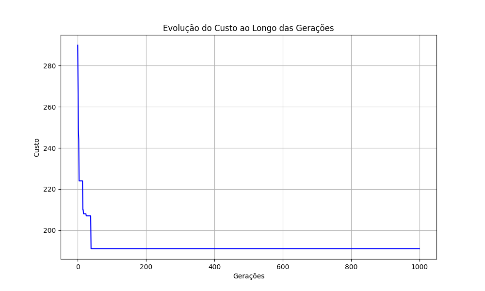
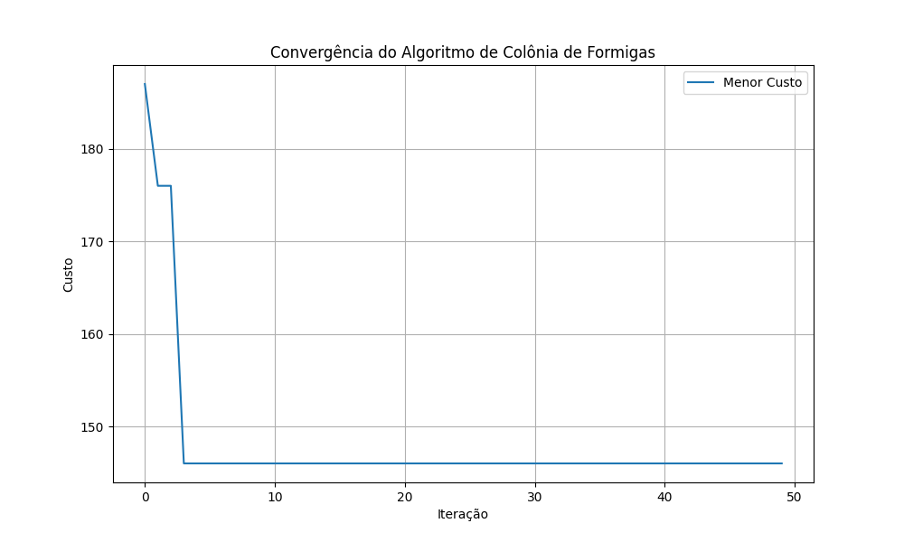

Relatório de Convergência do Algoritmo Genético
<h2>1. Introdução</h2>
Objetivo: Analisar a convergência dos algoritmos genético e de colônia de formigas implementados nos arquivos algoritmo_genetico.py e colonia.py.
<h3>Descrição do Algoritmo:</h3> 
Algoritmo Genético: técnica de otimização baseada nos princípios da seleção natural e genética. Ele utiliza operações como seleção, crossover e mutação para evoluir soluções ao longo de várias gerações. 
Algoritmo de Colônia de Formigas: Técnica de otimização inspirada no comportamento de busca de alimento das formigas. Utiliza a comunicação indireta entre formigas através de feromônios para encontrar soluções ótimas.

<h2>2. Metodologia</h2>
<h3>Parâmetros Utilizados:</h3>

<h4>Algoritmo Genético:</h4>
Tamanho da População: 100  
Número de Gerações: 1000  
Probabilidade de Mutação: 0.1  
Tamanho do Torneio: 3
<h4>Algoritmo de Colônia de Formigas:</h4>
Número de Formigas: 100  
Número de Iterações: 1000  
Taxa de Evaporação de Feromônio: 0.1  
Intensidade do Feromônio: 1.00  
Alfa (influência do feromônio): 1  
Beta (influência da visibilidade): 2  

<h2>3. Implementação</h2>
<h3>Algoritmo Genético</h3>
<h4>Função Principal:</h4>
algoritmo_genetico  
<h4>Funções Auxiliares:</h4>
gerar_populacao_inicial  
selecao_torneio  
crossover_pmx  
mutacao_inversao  
<h3>Algoritmo de Colônia de Formigas:</h3>
<h4>Função Principal:</h4>
colonia_de_formigas
<h4>Funções Auxiliares:</h4>
inicializar_feromonios
atualizar_feromonios
escolher_proxima_cidade
calcular_custo

<h2>4. Resultados</h2>

### Algoritmo Genético
O gráfico abaixo mostra a convergência do algoritmo genético ao longo das gerações:

### Algoritmo de Colônia de Formigas
O gráfico abaixo apresenta a convergência do algoritmo de colônia de formigas ao longo das iterações:

<h3>Análise do Gráfico</h3>
<h4>Algoritmo Genético:</h4>
Geralmente apresenta uma melhoria gradual, mas pode ter períodos de estagnação devido à dependência das operações de seleção, cruzamento e mutação. 
Pode apresentar flutuações no custo conforme explora novas soluções.
<h4>Colônia de Formigas:</h4>
Costuma ser mais consistente, com uma convergência contínua devido ao reforço dos feromônios em trajetos de boa qualidade. 
Pode ser mais eficiente em alcançar uma solução de menor custo, dependendo dos parâmetros.
